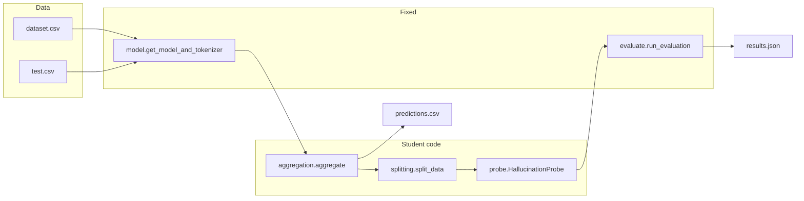
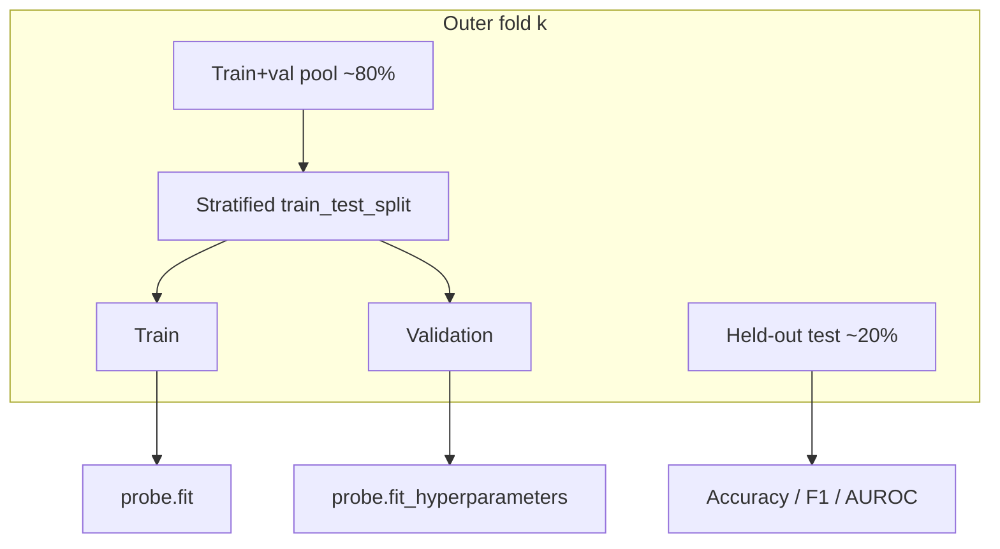
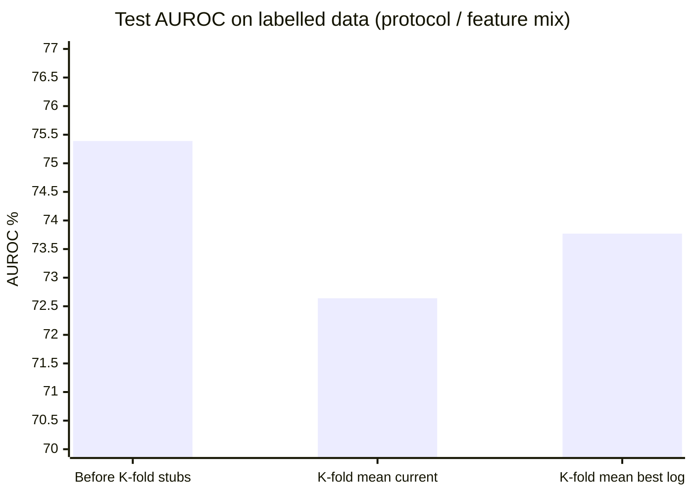

# SMILES-2026 Hallucination Detection

Binary **hallucination detection** for **[Qwen/Qwen2.5-0.5B](https://huggingface.co/Qwen/Qwen2.5-0.5B)** using frozen hidden states: we aggregate per-layer representations from `prompt + response`, train a small **probe** on `data/dataset.csv`, and write `predictions.csv` for `data/test.csv`.

**Competition ranking (official):** performance on the held-out **`test.csv`** (see task materials). **Internal development:** we mostly tracked **5-fold mean test AUROC** on the labelled set (see `evaluate.py` and `results.json`).

---

## Figures

### Figure 1 — End-to-end pipeline

How `solution.py` ties together the pieces you implement versus fixed infrastructure:



### Figure 2 — Splitting strategy (`splitting.py`)

We use **stratified 5-fold outer CV**: each fold holds out ~20% as **test** while preserving the label ratio. Inside the remaining ~80%, a **stratified train/validation** split reserves about **`val_size` (default 15%)** of the **full** dataset worth of points for **threshold tuning** (`fit_hyperparameters` on F1). Every sample appears in **test exactly once** across folds; train/val indices are re-drawn per fold with `random_state + fold_id` for the inner split.



### Figure 3 — Reported approaches vs internal mean test AUROC

Numbers are **mean test AUROC** (5-fold average, then mean over seeds 42–44) as recorded in the project’s `TESTS_*.md` files. They are **not** the competition `test.csv` score.

| Approach (short) | Documented mean test AUROC |
|------------------|---------------------------:|
| L23 last + norm23/norm22 + cosine + distance + ReLU MLP | **73.77%** (`TESTS_Ratio.md`) |
| L6 + L22 + norm22/norm21 + cos(h6,h22) + SiLU MLP | 73.17% (`TESTS_6n22_layer.md`) |
| L19/L22/L23 + chain-graph spectral scalars + norm + SiLU MLP | 72.57% (`TESTS_FINAL.md`) |
| L12 + L23 + norm + sklearn PCA(128) + MLPClassifier | 66.20% (`TESTS_12n23_layer.md`) |

**K-fold reporting (what the numbers feel like):** after switching to **5-fold** stratified evaluation, **most** logged mean test AUROCs sit **around 72–73%** or lower; only the strongest geometry line (`TESTS_Ratio.md`) lands **just above** that band (**~73.8%**). Earlier **single-split** / layer-sweep logs (e.g. `TESTS.md`, `TESTS_Geometry.md`) often showed **~75%+** test AUROC on a **single** partition—useful for exploration, but **optimistic** compared to the K-fold mean.

Higher internal AUROC is better **for that evaluation protocol**; the best line in the K-fold table is still the **compact L23 geometry** row.

### Figure 4 — All metrics: before K-fold vs K-fold mean

This compares **evaluation protocols** on the **689-sample labelled set**. Numbers are **not** the competition `test.csv` score.

- **Before K-fold (single stratified split):** one train / val / test partition (**481 / 104 / 104**), from **`BASELINE.md`** (run with **default student stubs**: last-token **896-D** features, legacy probe). This is the archived “single `split_data` entry” era.
- **K-fold (mean over 5 folds):** current **`splitting.py`** (outer **StratifiedKFold** `k=5` + inner stratified val). Values are means of the per-fold metrics in **`results.json`** produced by `python solution.py` with **`PROBE_RANDOM_SEED=42`** and the **current** `aggregation.py` / **`probe.py`** (**2693-D** features at time of that run: spectral-style stack + L19/L22/L23 last tokens + norm ratio).

| Split | Metric | Before K-fold (`BASELINE.md`) | K-fold mean (`results.json`, 5 folds) |
|-------|--------|--------------------------------:|--------------------------------------:|
| **Train** | Accuracy | 70.06% | 82.38% |
| **Train** | F1 | 82.40% | 88.89% |
| **Train** | AUROC | 99.998% | 97.14% |
| **Val** | Accuracy | 70.19% | 74.23% |
| **Val** | F1 | 82.49% | 83.75% |
| **Val** | AUROC | 67.90% | 69.91% |
| **Test** | Accuracy | 70.19% | 70.10% |
| **Test** | F1 | 82.49% | 80.67% |
| **Test** | AUROC | **75.39%** | **72.64%** |

**Majority baseline on test** (same sources): **70.19%** acc / **82.49%** F1 (single split) vs **70.10%** / **82.42%** averaged over folds (K-fold).

For **K-fold** with the strongest **logged** feature set (L23 + norm ratio + geometry, `TESTS_Ratio.md`), mean **test** AUROC over seeds 42–44 is **73.77%** (mean test acc **70.68%**, mean test F1 **81.59%**); train/val for that line were not tabulated in that file.

**Test AUROC only (bar view)**



The middle bar is **not** comparable feature-for-feature to the first (different `aggregation.py` / probe). Single-split logs can sit **~75%+** on one partition; **K-fold means** for the same development period mostly land **under ~73%** test AUROC (the **~73.8%** “best log” bar is the exception: `TESTS_Ratio.md`). Treat that as **less luck, more realism** when comparing eras.

---

## What we did and why

**Splitting (`splitting.py`).** We replaced a single random split with **stratified K-fold** so metrics are less lucky on one partition, and we kept a **validation** slice inside each fold so the probe can tune a **decision threshold** on probabilities without peeking at the fold’s test indices. Stratification matches the **skewed label ratio** in `dataset.csv` (~70% hallucinated), which stabilizes fold-wise prevalence. In practice, **mean test AUROC under K-fold** clustered **around or below ~73%** for most feature stacks we logged; that is lower than many **single-split** layer sweeps (~**75%+** in `TESTS.md` / `TESTS_Geometry.md`) and reflects **harder, repeated** test draws rather than one easy test fold.

**Aggregation (`aggregation.py`).** We iterated on **which layers** and **what geometry** to expose to the probe. Facts from the logged experiments:

- A **low-dimensional** descriptor based on **layer 23** (last token, norm ratio to layer 22, first–last cosine and distance) reached the **highest mean test AUROC (~73.77%)** among the approaches summarized above.
- Adding **more layers** and **higher-dimensional** vectors (e.g. dual last-token cores, spectral-style stacks) did **not** consistently beat that simpler recipe on the same protocol.
- A **sklearn pipeline** with **PCA(128)** on ~1793 features underperformed the **PyTorch MLP** on those runs, suggesting variance/noise structure that PCA + small MLP did not handle as well as end-to-end scaling + the SiLU/ReLU heads we tried.

**Probe (`probe.py`).** We kept a **small MLP** on **StandardScaler**-normalized features, **class imbalance** via `BCEWithLogitsLoss` positive weighting, **AdamW** and a **cosine LR schedule**, and **validation-based thresholding**—because AUROC uses scores but F1/accuracy on the leaderboard-style metrics benefit from a tuned cutoff.

**Spectral / paper-inspired work.** We drew ideas from spectral guardrail literature (attention-graph Laplacians), but **`solution.py` is fixed** and does not pass **attention weights**, so faithful attention–Laplacian features are not available without changing that pipeline. The **`TESTS_FINAL`** configuration uses the **same formulas** on a **path-graph proxy** built from hidden states (adjacent-token cosine), which is honest but **not** identical to the paper’s topology.

---

## Conclusion

Under **5-fold stratified evaluation** on the **689-sample** labelled set, the **strongest reproducible signal** in our logged sweep came from **staying close to the late layer (23)**: last-token vector plus a few **cheap geometric scalars** (especially **norm ratio to layer 22**), probed with a **compact PyTorch MLP** and **threshold tuning on a stratified validation slice**. Bigger feature stacks and alternative probes were worth trying, but **did not beat that baseline** in the documented internal metrics. The **official competition outcome** still depends on **generalization to `test.csv`**, which we do not label locally—so treat internal AUROC as **model selection guidance**, not a guarantee on the hidden test set.

**AUROC peaks (logged):** the **highest before K-fold** is in **`tests/TESTS_Geometry.md`**: mean test AUROC up to **75.89%** (layer 22 with geometry scalars). The **75.45%** value is the **mean** test AUROC for **layer 22** in the **last-token-only** sweep **`tests/TESTS.md`** (no extra geometry). The **highest after K-fold** (5-fold mean over seeds 42–44) is **`tests/TESTS_Ratio.md`**: **73.77%** mean test AUROC (L23 + norm ratio + cosine + distance).

---

## Repository layout

```
├── data/
│   ├── dataset.csv       # Labelled training data
│   └── test.csv          # Unlabelled test set
├── solution.py           # Main entry (orchestrates extract → split → evaluate → predict)
├── aggregation.py        # Hidden-state → feature vector
├── probe.py              # HallucinationProbe
├── splitting.py          # split_data (K-fold + stratified val)
├── model.py              # Fixed: loads Qwen2.5-0.5B
├── evaluate.py           # Fixed: metrics, results.json
├── requirements.txt
└── TESTS_*.md            # Logged experiment summaries
```

---

## Quick start

```bash
pip install -r requirements.txt
python solution.py
```

Optional: set `PROBE_RANDOM_SEED` for reproducible probe training.

---

## Dataset (brief)

| Column | Description |
|--------|-------------|
| `prompt` | ChatML context up to assistant turn |
| `response` | Model continuation (includes EOS) |
| `label` | `0` truthful · `1` hallucinated |

`data/test.csv` has null labels; `solution.py` writes **`predictions.csv`**.

---

## Notebooks and `.gitignore`

**`test.ipynb`** (and any `*.ipynb`) is ignored by git in this repo because **`.gitignore` contains `*.ipynb`**. That keeps notebooks and checkpoints out of version control by default. If you need to **commit** a notebook, remove or narrow that pattern (for example ignore only `.ipynb_checkpoints/`).

---

## SMILES-2026 application requirements (FAQ)

**Q1: What must the applicant submit in the application form?**

**A1:** Submit:

1. A link to your GitHub repository  
2. A link to your `predictions.csv` on publicly reachable cloud storage  

**Q2: What must applicants include in the repository?**

**A2:** Your repository must contain:

1. **`results.json`** — produced by the official `solution.py`  
2. A report in Markdown: **`SOLUTION.md`**  

**Q3: Report requirements (`SOLUTION.md`)**

**A3:** Your report must include:

- **Reproducibility instructions:** exact commands to reproduce your solution and obtain the same `predictions.csv`, required environment (if any), and any important implementation details.  
- **Final solution description:** which components you modified, what the final approach is, why you made those choices, and what helped the metric most.  
- **Experiments and failed attempts:** ideas you tried but did not keep, and why they were dropped or underperformed.  

**Q4: Reproducibility**

**A4:** The repository must be **self-contained** and runnable with the provided **`solution.py`**. You must **not** rely on changes to fixed infrastructure (`model.py`, `evaluate.py`). Running `python solution.py` must generate the **`predictions.csv`** you submit.

**Note:** This repo’s `.gitignore` lists **`*.ipynb`**, so notebooks are not tracked unless you change that. **`results.json`** is *not* ignored by the snippet above, so it can be committed as required for submission **A2**. (Optional entries like `BASELINE.md` / `README_ONE.md` / `README_TWO.md` are ignored—remove those lines if you want them in git.)
